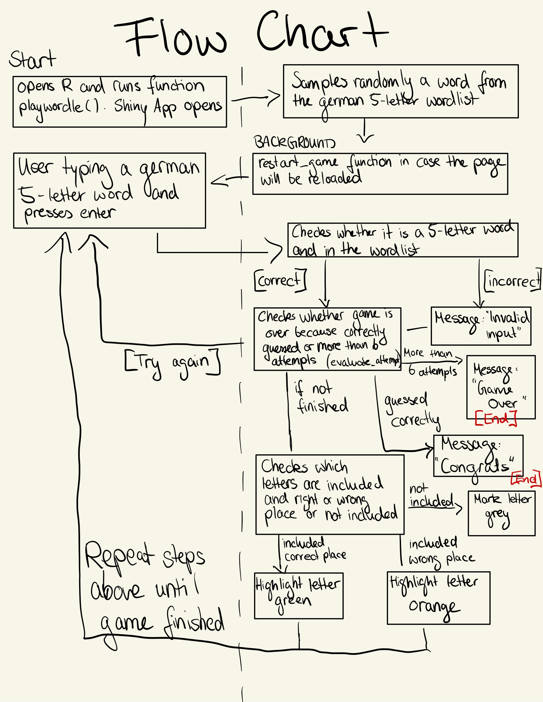

## Description

This project is a German version of the popular game "Wordle". People need to guess a five letter German word. They only have six attempts. They receive the information whether they guessed a letter correct with the right position, correct with a wrong position or not correct.

## Scenario and Example

Purpose: Scenario that describes the use of the online game "Wordle" in German by a random German speaking person. I will use Screenshots to illustrate an example.

**Individual:** User A, a German speaking person

**Equipment:** A computer with R, my package(GermanWordle), shiny, htmltools and bslib installed

**Scenario with Examples:**

1\. User A opens the shiny app by installing the germanwordle package, load it from the library and using "playwordle()".

2\. The shiny app displays the German Wordle with a short description and six rows of five blank tiles.

{width="262"}

3\. User A reads the description "Guess the Wordle in 6 tries. Each guess must be a valid 5-letter word. The color of the tiles will change to show how close your guess was to the word."

4\. User A types in their first guess of a German five letter word (e.g., "HALLO") and clicks enter.

{width="253"}

5\. User A sees which letters are correct and in the right place (highlighted green), correct but in the wrong place (highlighted yellow) or incorrect (highlighted gray).

Example: Here only L is correct, H and O are correct but in a wrong place and A is incorrect. User A now knows that L needs to be the third letter of the word, only one L is included, and that H and O are included.

7\. User A thinks of a second word and types it in. This word does not exist, thus they receive a message, that they need to think of a German word that does exist.

Example: User types in "OBRAW". This word is not a german existing 5 letter word.

{width="240"}

8\. User A closes the tab and deletes the false guess and comes up with a new existing word.

Example: User A comes up with "BODEN" and clicks enter.

{width="273"}

9\. Again, the program highlights correct and incorrect letters.

Example: Now User A knows that again O is the second letter and B, D, E and N are not included.

10\. User A types a new word. Its their third attempt.

Example: User A types in a third word "DOLCH".

{width="270"}

11\. Again, the program highlights correct and incorrect letters.

Example: The word "DOLCH" is almost correct, O, L, C, H are correct and on the right position. Only D is incorrect.

12\. User A types a new word. Its their fourth attempt. This word is correct, therefore all letters are highlighted green and User A receives the message: "Congrats. You've guessed the word correctly within 6 attempts! The word was: xxx".

Example: User A types in the word "SOLCH". Therfore it sees the congratulations message and that the word was indeed SOLCH.

{width="228"}

12\. User A closes the pop up message and can now close this page or reload it. If it is reloaded the user can guess a new word. In this case User A closes the page.

13\. In case the user does not correctly guess the word in 6 attempts, they will see the message "Game Over. Next time! The correct word was: XXX."

Example:

{width="251"}

## Flow Chart

{width="517"}

## How To For Users

The usage is very simple. User can enter letters by either using their own keyboard or the keyboard on the shiny app. After five letters are typed in, the user need to press enter either on their own keyboard or on the shiny app keyboard. If the word is not existing a pop up window will inform the user about it. The window need to be closed before continuing playing. After closing the window the user needs to delete the letters they wrote and type in a new word.

If the game is finished (either because the word is guessed correctly or after six attempts), a pop up window with a message pops up. This window need to be closed. The user can start a new game by either reloading the page or clicking on "New game".

{width="265"}

{width="266"}

{width="264"}
